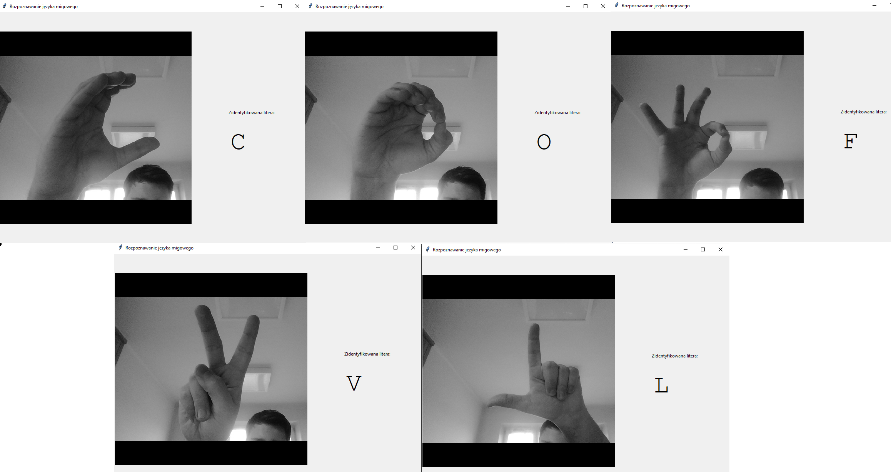

## Rozponawanie amerykańskiego języka migowego
Projekt został zrealizowany w ramach przedmiotu Analiza Obrazów.

# Cel

Identyfikacja liter alfabetu amerykańskiego języka migowego na podstawie obrazu z kamery z wykorzystaniem przetwarzania obrazów i sieci neuronowej.

# Wymagania

- Python3.x (przetestowane na Python3.7.7)]

- kamera komputerowa

# Instalacja i używanie

Zainstalwoanie niezbędnych bibliotek
- pip install -r requirements.txt

Uruchamianie głównego programu:
- python3 main.py

Możliwe jest wytrenowanie własnej sieci neuronowej. W tym celu należy zmodyfikować i uruchomić:
- python3 network_training.py

Alfabet amerykańskiego języka migowego

# Obecna funkcjonalność

Program rozpoznaje część charakterystycznych liter. Z rozpoznaniem liter o subtelnych różnicach nadal ma problem.

# Przyczyny niedoskonałości aplikacji

- Mały rozmiar wejściowy dancyh do sieci (28 x 28)
- Mały zbiór danych trningowych

## Członkowie zespołu

- Marcin Filipek - Algorytm
- Michał Ćwierz - Interfejs
- Agnieszka Lasek - Dokumentacja
